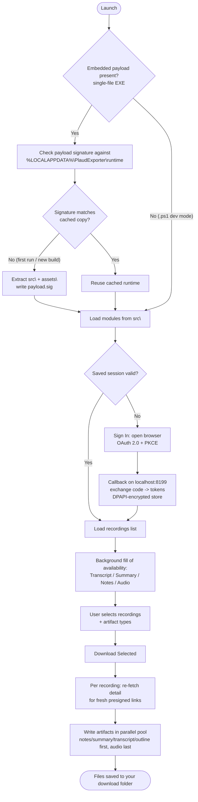

# Plaud Exporter

A Windows desktop app for **bulk-exporting your [Plaud](https://www.plaud.ai/) recordings** — transcripts, AI summaries, notes, and audio — to a folder of your choice.

Sign in with your Plaud account, browse every recording with at-a-glance availability of each artifact type, tick the ones you want, and download them in parallel. Built in PowerShell + WinForms and compilable to a single standalone `.exe`.

> **Unofficial / independent project.** Not affiliated with, authorized by, endorsed by, or sponsored by Plaud Inc. See [Disclaimer](#disclaimer).

---

## Table of contents

- [Features](#features)
- [Requirements](#requirements)
- [How it works](#how-it-works)
- [Quick start (GUI)](#quick-start-gui)
- [Command-line usage](#command-line-usage)
- [Building a standalone EXE](#building-a-standalone-exe)
- [Where it stores things](#where-it-stores-things)
- [Repository layout](#repository-layout)
- [Troubleshooting](#troubleshooting)
- [Disclaimer](#disclaimer)
- [License](#license)

---

## Features

- **Browser-based sign-in** using OAuth 2.0 with PKCE — your password is never seen or stored by the app. Tokens are kept in a DPAPI-encrypted file scoped to your Windows user, and refreshed silently.
- **One row per recording** with live availability columns: Transcript, Summary, Notes (with tab count), and Audio, filled in the background so the list is usable immediately.
- **Date filter** with quick presets (Today, Last 7/30 days, This month) and a custom From/To range. The app re-queries Plaud for the chosen window so the list shows only matching recordings.
- **Pick exactly what you want** per export: Transcript, Summary, Notes, Audio, Polished Transcript, and Outline.
- **Parallel downloads** sized to a configurable limit, with a progress bar and per-row success/failure colouring.
- **Readable output** — transcripts are written as `[time] Speaker: text`, outlines as Markdown, summaries/notes as their native Markdown; audio saved as `.mp3`.
- **Single self-contained EXE** option — no loose folders, no installer, no admin rights.
- **Scriptable** — the underlying PowerShell modules can be used headlessly for automation (see [Command-line usage](#command-line-usage)).

---

## Requirements

### To run the app

| Requirement | Notes |
| --- | --- |
| Windows 10 or 11 (64-bit) | Uses Windows-only features (WinForms, DPAPI). No macOS/Linux. |
| .NET Framework 4.x | Ships with Windows 10/11 — nothing to install. |
| A [Plaud account](https://www.plaud.ai/) | Sign-in happens in your browser. |
| Default web browser | For the OAuth sign-in page. |
| Outbound network access | To `web.plaud.ai`, `platform.plaud.ai`, and `*.amazonaws.com` (presigned download links). |
| Local TCP port **8199** free | The OAuth callback binds `http://localhost:8199/auth/callback` during sign-in. |

No administrator rights are required. The app runs unelevated, which is necessary for the localhost OAuth callback.

> Running the **`.ps1`** directly (instead of the compiled EXE) additionally needs **Windows PowerShell 5.1** (the built-in `powershell.exe`, not PowerShell 7), run from a normal console — not the ISE. You may need a permissive execution policy, e.g. `powershell -ExecutionPolicy Bypass -File .\PlaudExporter.ps1`.

### Download Compiled EXE
To download a copy of Plaud Exporter as an EXE file, click here: [Download EXE](https://github.com/kevinshoaf/Plaud-Exporter/raw/refs/heads/main/PlaudExporter.exe)

### To build the EXE yourself

| Requirement | Link |
| --- | --- |
| Windows PowerShell 5.1 | Built into Windows (PS2EXE does not run under PowerShell 7). |
| PS2EXE module | <https://github.com/MScholtes/PS2EXE> — auto-installed for the current user by the build script if missing (needs one-time PowerShell Gallery access). |

### Optional

| Component | Why | Link |
| --- | --- | --- |
| **Plaud CLI** (`@plaud-ai/cli`) | Not required. If you already use the official Plaud CLI and have signed in with it, the app can import its session as a fallback (reads `%USERPROFILE%\.plaud\tokens.json`). | <https://support.plaud.ai/hc/en-us/articles/57751026815257-Plaud-CLI> |
| **Node.js** | Only needed if you choose to install the Plaud CLI above. | <https://nodejs.org/> |

> **The app does not depend on the Plaud CLI** — it performs its own OAuth sign-in. The CLI is listed only because its stored session can optionally be reused.

---

## How it works



A few notes on the design:

- **Single-file extraction is per-user and cached.** A standalone EXE carries `src\` and `assets\` as a compressed payload; on launch it unpacks them to `%LOCALAPPDATA%\PlaudExporter\runtime` and stores a signature. Subsequent launches reuse the cache and only re-extract after you build a new version.
- **Presigned links are short-lived.** Note/polished links expire about 5 minutes after they are issued, so the app re-fetches each recording's detail at download time rather than relying on links gathered during the availability pass. This is why downloads need a live connection at the moment you click.
- **The UI never blocks.** All network calls run on background runspaces; a single timer harvests results and updates the grid.

---

## Quick start (GUI)

1. Download/clone the project (or grab the single EXE from a release).
2. Launch it:
   - **EXE:** double-click `PlaudExporter.exe`.
   - **Script:** `powershell -ExecutionPolicy Bypass -File .\PlaudExporter.ps1`
3. Click **Sign In** — your browser opens the Plaud authorization page. Approve, and the app picks up the session automatically.
4. The recordings list loads and availability columns fill in.
5. Tick the recordings you want, choose the artifact types (Transcript / Summary / Notes / Audio / Polished / Outline), set the download folder and parallelism under **Settings**, then click **Download Selected**.

---

## Command-line usage

The app is GUI-first, but the PowerShell modules under `src\` are a fully scriptable layer. The bundled `Test-*.ps1` harnesses exercise that layer directly and double as handy CLI tools. Run them from the project root in **Windows PowerShell 5.1**.

### Authentication

```powershell
# Sign in (opens your browser), check status, refresh, or sign out
.\Test-PlaudAuth.ps1 -Login
.\Test-PlaudAuth.ps1 -Status
.\Test-PlaudAuth.ps1 -Refresh
.\Test-PlaudAuth.ps1 -Logout

# Optional: import a session from the official Plaud CLI (~/.plaud/tokens.json)
.\Test-PlaudAuth.ps1 -ImportCli
```

### Listing recordings and checking availability

```powershell
# Friendly list (newest first), or the raw API objects
.\Test-PlaudData.ps1 -List
.\Test-PlaudData.ps1 -RawList

# Availability (Transcript/Summary/Notes/Audio) for the most recent N recordings
.\Test-PlaudData.ps1 -Availability -Top 8

# Full detail for one recording
.\Test-PlaudData.ps1 -Detail -Id 2e136d5bc090adad523c91d175ecd32c
```

### Downloading

```powershell
# Everything for one recording (Transcript, Summary, Notes, Audio, Polished, Outline)
.\Test-PlaudDownload.ps1 -Id 2e136d5bc090adad523c91d175ecd32c -All

# Text only (skip the large audio file), into a chosen folder
.\Test-PlaudDownload.ps1 -Id 2e136d5bc090adad523c91d175ecd32c -NoAudio -To "D:\Exports"

# Force re-download of files that already exist
.\Test-PlaudDownload.ps1 -Id 2e136d5bc090adad523c91d175ecd32c -All -Overwrite
```

### Using the modules in your own scripts

```powershell
Import-Module .\src\PlaudAuth.psm1    -Force
Import-Module .\src\PlaudData.psm1    -Force
Import-Module .\src\PlaudDownload.psm1 -Force

$token = Get-PlaudAccessToken            # uses the saved session; sign in first if needed
$recordings = Get-PlaudRecordingList -AccessToken $token

# Download summaries + transcripts for everything captured today
$today = (Get-Date).ToString('yyyy-MM-dd')
foreach ($r in $recordings | Where-Object { $_.When -like "$today*" }) {
    Invoke-PlaudRecordingDownload -Id $r.Id `
        -DownloadRoot "$env:USERPROFILE\Downloads\PlaudExports" `
        -Types @('Transcript','Summary') -AccessToken $token
}
```

Key exported functions: `Connect-PlaudAccount`, `Get-PlaudAccessToken`, `Get-PlaudCurrentUser`, `Get-PlaudRecordingList`, `Get-PlaudRecordingAvailability`, `Get-PlaudRecordingArtifacts`, `Invoke-PlaudRecordingDownload`.

---

## Building a standalone EXE

The build script compiles the GUI to a 64-bit, no-console, non-elevated EXE with the app icon and version info via [PS2EXE](https://github.com/MScholtes/PS2EXE).

```powershell
# Preview what will happen (builds nothing)
.\Build-PlaudExporter.ps1 -WhatIf

# Single self-contained EXE (default) -> dist\PlaudExporter.exe, plus a zip
.\Build-PlaudExporter.ps1 -Zip

# Set version / author resource fields
.\Build-PlaudExporter.ps1 -Version 1.2.0.0 -Company "Your Name"

# Old layout instead: EXE + loose src\ and assets\ folders
.\Build-PlaudExporter.ps1 -Portable
```

In **single-file** mode the whole deliverable is `dist\PlaudExporter.exe` — distribute just that one file.

> The EXE is unsigned, so Windows SmartScreen may warn on first launch (**More info -> Run anyway**).

---

## Where it stores things

Everything lives under your user profile — nothing is written to shared or system locations, and no admin rights are needed.

| Item | Location |
| --- | --- |
| Encrypted session token | `%APPDATA%\PlaudExporter\session.dat` |
| Settings (download folder, parallelism, last artifact selection) | `%APPDATA%\PlaudExporter\config.json` |
| Logs | `%LOCALAPPDATA%\PlaudExporter\Logs` (fallback `%APPDATA%`, then `%TEMP%`) |
| Unpacked runtime (single-file EXE only) | `%LOCALAPPDATA%\PlaudExporter\runtime` |
| Exported recordings | Your chosen download folder (default `%USERPROFILE%\Downloads\PlaudExports`) |

---

## Repository layout

```text
PlaudExporter/
├─ PlaudExporter.ps1          # GUI entry point
├─ Build-PlaudExporter.ps1    # PS2EXE build (single-file default; -Portable for folder layout)
├─ Test-PlaudAuth.ps1         # auth CLI / harness
├─ Test-PlaudData.ps1         # list / availability / detail CLI / harness
├─ Test-PlaudDownload.ps1     # download CLI / harness
├─ src/
│  ├─ PlaudAuth.psm1          # OAuth PKCE, token store, session, logging
│  ├─ PlaudData.psm1          # list, detail, availability, artifact descriptors
│  ├─ PlaudConfig.psm1        # per-user JSON config
│  ├─ PlaudDownload.psm1      # parallel download engine + output formatters
│  └─ PlaudIcon.ps1           # embedded base64 window/taskbar icon
└─ assets/
   ├─ appicon.ico             # EXE icon (compile-time)
   └─ logo.png                # header logo
```

---

## Troubleshooting

- **"Address already in use" / sign-in never completes.** Something is holding TCP port `8199` (often a running `plaud login`/MCP session). Close it and try again.
- **Browser opens but nothing happens after approving.** Make sure you returned to the app window; the callback completes there. If your default browser blocks `localhost`, try a different default browser.
- **A note or polished transcript fails to download.** Its presigned link likely expired — just click Download again; the app re-fetches fresh links each run.
- **SmartScreen blocks the EXE.** It is unsigned: **More info -> Run anyway**, or run the `.ps1` instead.
- **Nothing logs to `D:\Logs`.** By design — this app logs under your user profile (see [above](#where-it-stores-things)).

---

## Disclaimer

Plaud Exporter is an **unofficial, independent tool**. It is not affiliated with, authorized by, endorsed by, or sponsored by Plaud Inc.

**Plaud is a trademark of Plaud Inc.** All other product and company names are the property of their respective owners.

This app uses Plaud's API and OAuth on your behalf. Your use of Plaud's services through this app is subject to Plaud's Terms of Service, and **you are solely responsible for complying with them**. The project's license covers this app's source code only and grants no rights to Plaud's services, data, accounts, or trademarks.

---

## License

Released under the **MIT License** — see [`LICENSE`](LICENSE).

App icon: "Radio" icons created by [Freepik - Flaticon](https://www.flaticon.com/free-icons/radio).
